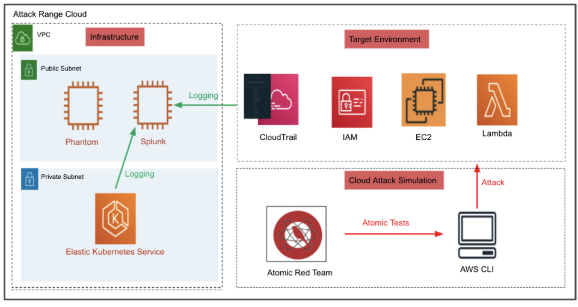

# Splunk Attack Range Cloud ⚔️

## Purpose 🛡
The Attack Range Cloud is a detection development platform, which solves three main challenges in detection engineering. First, the user is able to build quickly a small lab infrastructure as close as possible to a cloud environment. Second, the Attack Range performs attack simulation using different engines such as [Atomic Red Team](https://github.com/redcanaryco/atomic-red-team) in order to generate real attack data.
## Building 👷‍♂️

Attack Range Cloud can be built is currently:

- **cloud-only**, Specifically simulate attacks against AWS


## Architecture 🏯
The Attack Range Cloud consists of:
- pre-configured Splunk server with AWS Cloudtrail logs and Kubernetes logs
- pre-configured Phantom server
- AWS Elastic Kubernetes Service with a Wordpress app and [Splunk Connect for Kubernetes](https://github.com/splunk/splunk-connect-for-kubernetes)

- integrated [Atomic Red Team](https://github.com/redcanaryco/atomic-red-team) cloud attacks



### Logging
The following log sources are collected from the machines:
- Cloudtrail logs (```index=aws```)
- Kubernetes logs (```index=kubernetes```)
- Kubernetes metrics (```index=kubernetes-metrics```)
- AWS Elastic Kubernetes Service logs (```index=aws sourcetype=aws:cloudwatchlogs```)

## Running 🏃‍♀️
Follow [Getting Started](https://github.com/splunk/attack_range_cloud/wiki/Configure-Cloud-Attack-Range) to configure Attack Range Cloud.  
Attack Range Cloud supports different actions:
- Build Attack Range Cloud
- Perform Cloud Attack Simulation
- Destroy Attack Range Cloud
- Stop Attack Range Cloud
- Resume Attack Range Cloud

### Attack Range Cloud Commands
- Configure your Attack Range Cloud .conf
```
- [x] python attack_range_cloud.py configure
```

### Attack Range Cloud Commands
- Build Attack Range Cloud
```
- [x] python attack_range_cloud.py build

```

### Perform Cloud Attack Simulation
[Work in Progress]
- Perform Cloud Attack Simulation by Mitre technique
```
python attack_range_cloud.py simulate -st T1136.003
```

### Destroy Attack Range Cloud
- Destroy Attack Range Cloud
```
python attack_range_cloud.py destroy
```

### Stop Attack Range Cloud
- Stop Attack Range Cloud
```
python attack_range_cloud.py stop
```

### Resume Attack Range Cloud
- Resume Attack Range Cloud
```
python attack_range_cloud.py resume
```

## Features 💍
- [Splunk Server](https://github.com/splunk/attack_range/wiki/Splunk-Server)
  * Preconfigured with multiple TAs for field extractions
  * Out of the box Splunk detections with Enterprise Security Content Update ([ESCU](https://splunkbase.splunk.com/app/3449/)) App
  * Preinstalled Machine Learning Toolkit ([MLTK](https://splunkbase.splunk.com/app/2890/))
  * Splunk UI available through port 8000 with user admin
  * ssh connection over configured ssh key

- [Splunk Enterprise Security](https://splunkbase.splunk.com/app/263/)
  * [Splunk Enterprise Security](https://splunkbase.splunk.com/app/263/) is a premium security solution requiring a paid license.
  * Enable or disable [Splunk Enterprise Security](https://splunkbase.splunk.com/app/263/) in [attack_range_cloud.conf](attack_range_cloud.conf)
  * Purchase a license, download it and store it in the apps folder to use it.

- [Splunk Phantom](https://www.splunk.com/en_us/software/splunk-security-orchestration-and-automation.html)
  * [Splunk Phantom](https://www.splunk.com/en_us/software/splunk-security-orchestration-and-automation.html) is a Security Orchestration and Automation platform
  * For a free development license (100 actions per day) register [here](https://my.phantom.us/login/?next=/)
  * Enable or disable [Splunk Phantom](https://www.splunk.com/en_us/software/splunk-security-orchestration-and-automation.html) in [attack_range_cloud.conf](attack_range_cloud.conf)

-  [Atomic Red Team](https://github.com/redcanaryco/atomic-red-team)
  * Attack Simulation with  [Atomic Red Team](https://github.com/redcanaryco/atomic-red-team)
  * Uses Attack TTPs from [Cloud ATT&CK Mitre IDs](https://attack.mitre.org/matrices/enterprise/cloud/)


## Support 📞
Please use the [GitHub issue tracker](https://github.com/splunk/attack_range_cloud/issues) to submit bugs or request features.

If you have questions or need support, you can:

* Post a question to [Splunk Answers](http://answers.splunk.com)
* Join the [#security-research](https://splunk-usergroups.slack.com/archives/C1S5BEF38) room in the [Splunk Slack channel](http://splunk-usergroups.slack.com)
* If you are a Splunk Enterprise customer with a valid support entitlement contract and have a Splunk-related question, you can also open a support case on the https://www.splunk.com/ support portal


## Author
* [Patrick Bareiß](https://twitter.com/bareiss_patrick)
* [Bhavin Patel](https://twitter.com/hackpsy)
* [Jose Hernandez](https://twitter.com/d1vious)


## License

Copyright 2020 Splunk Inc.

Licensed under the Apache License, Version 2.0 (the "License");
you may not use this file except in compliance with the License.
You may obtain a copy of the License at

http://www.apache.org/licenses/LICENSE-2.0

Unless required by applicable law or agreed to in writing, software
distributed under the License is distributed on an "AS IS" BASIS,
WITHOUT WARRANTIES OR CONDITIONS OF ANY KIND, either express or implied.
See the License for the specific language governing permissions and
limitations under the License.
